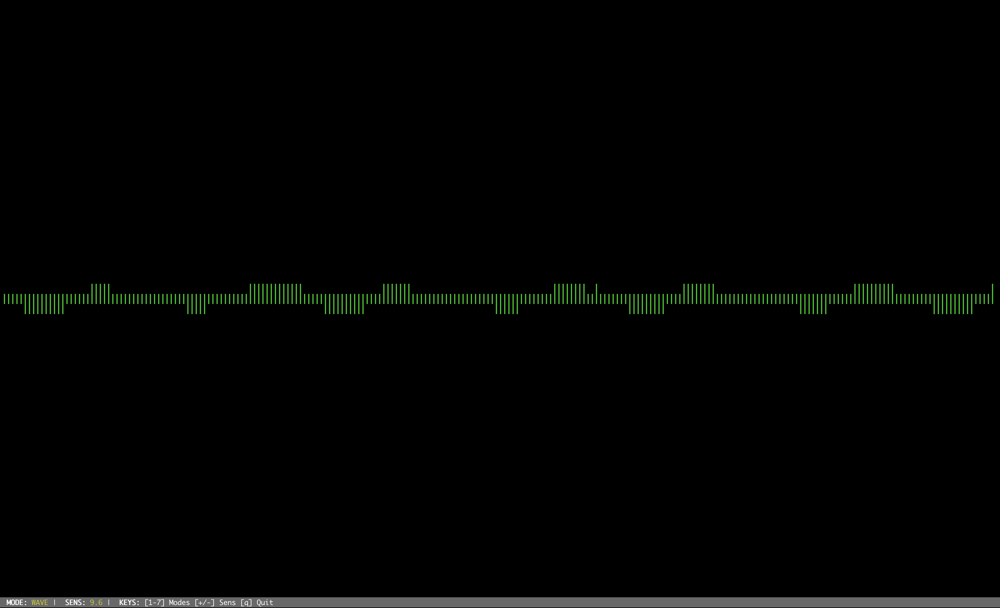
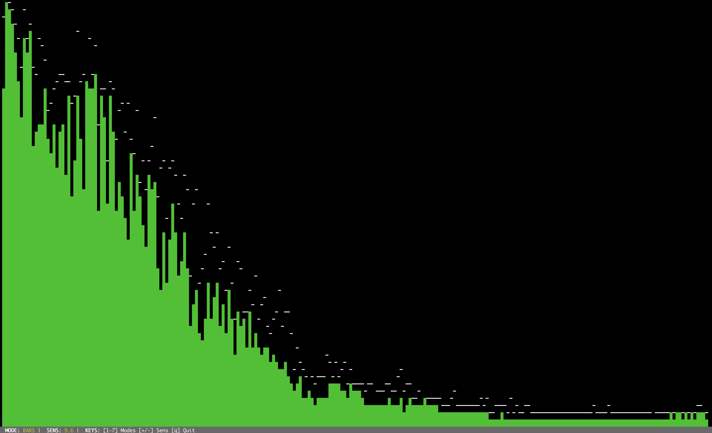
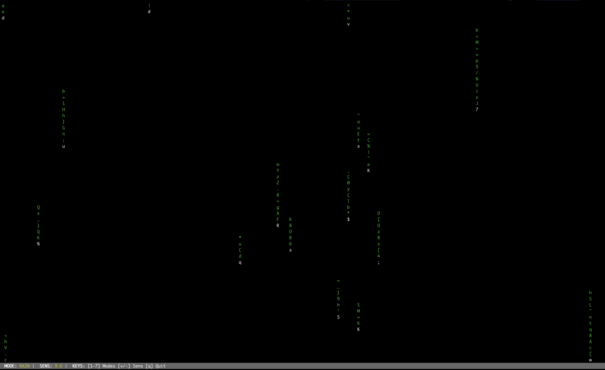
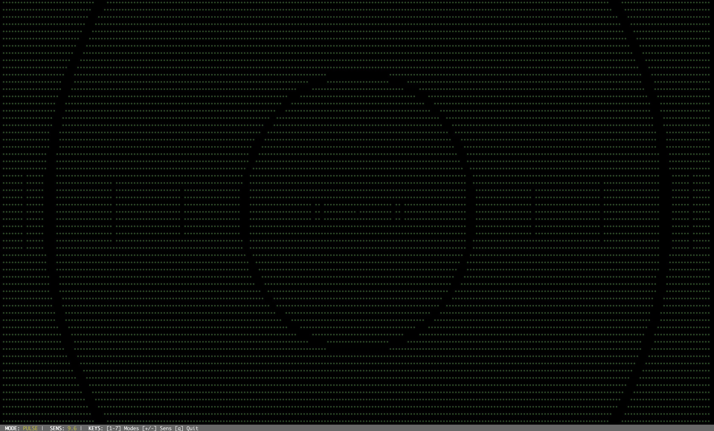
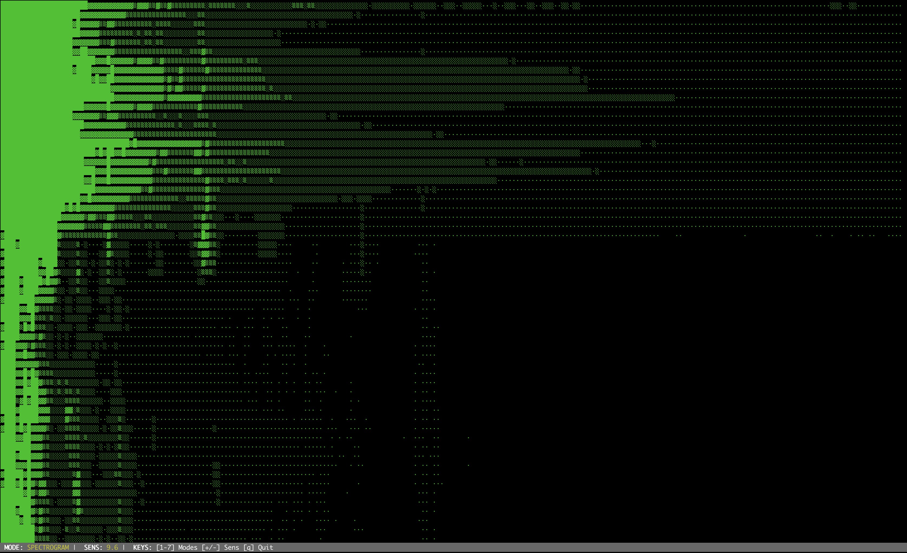
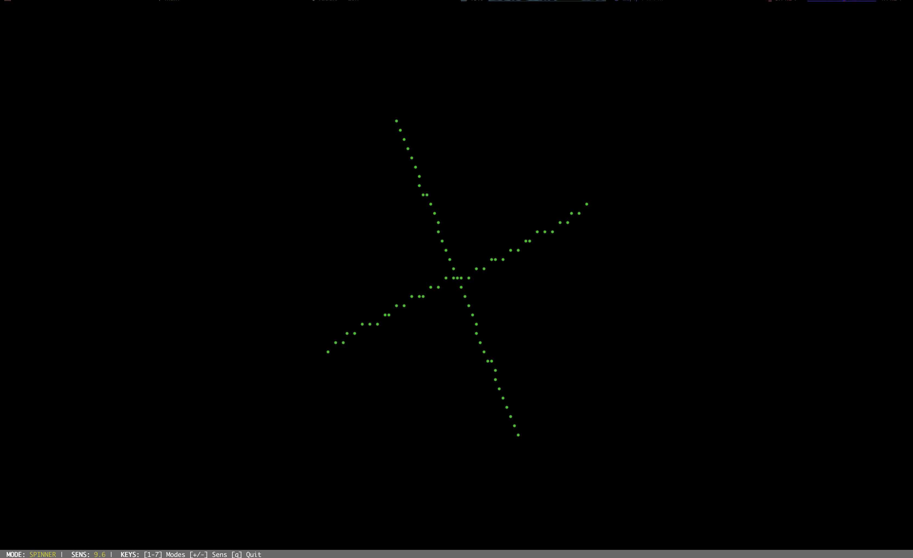
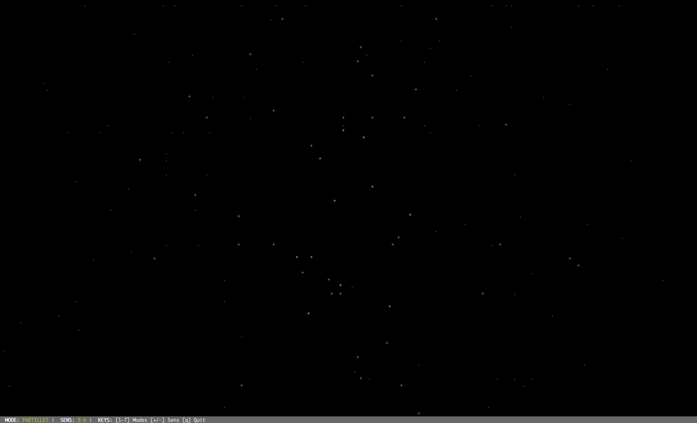

# vaudio

A polished, real-time microphone-driven terminal visualizer built with Rust.

## Gallery

| Bars Mode | Wave Mode | Rain Mode |
| :---: | :---: | :---: |
|  |  |  |

| Pulse Mode | Spectrogram | Spinner |
| :---: | :---: | :---: |
|  |  |  |

| Particles Mode |
| :---: |
|  |

**Pro Tip:** Use [VHS](https://github.com/charmbracelet/vhs) to create beautiful animated GIFs of `vaudio` in action!

## Quick Start

If you have Rust installed, you can build and run `vaudio` immediately:

```bash
# Clone the repository
git clone https://github.com/nyinyiz/vaudio.git
cd vaudio

# Build and run in one step
cargo run --release
```

## Installation & Building

### Prerequisites
- **Rust Stable**: [Install Rust](https://rustup.rs/)
- **System Dependencies**:
  - **macOS**: None (uses native CoreAudio).
  - **Linux**: Requires `libasound2-dev` (ALSA).
  - **Windows**: None (uses WASAPI).

### Build for Release
To build a highly optimized binary:
```bash
cargo build --release
```
The resulting binary will be located at: `./target/release/vaudio`.

### Global Installation
To install `vaudio` as a command on your system:
```bash
cargo install --path .
```
After this, you can simply run `vaudio` from any directory.

## Usage

```bash
vaudio [OPTIONS]
```

### CLI Options
- `--mode <bars|wave|rain|pulse|spectrogram|spinner|particles>`: Set initial visualization mode (default: `bars`).
- `--fps <number>`: Target frames per second (default: `30`).
- `--sensitivity <number>`: Audio sensitivity multiplier (default: `10.0`).
- `--device <name>`: Specify input device name or index.
- `--list`: List all available input devices.
- `--no-color`: Disable color output for a monochrome look.
- `--mirror`: Mirror the visualization (especially useful in `bars` mode).

### Keyboard Controls
- `q`: Quit
- `1`: Switch to **Wave** mode
- `2`: Switch to **Bars** mode
- `3`: Switch to **Rain** mode
- `4`: Switch to **Pulse** mode
- `5`: Switch to **Spectrogram** mode
- `6`: Switch to **Spinner** mode
- `7`: Switch to **Particles** mode
- `+`: Increase sensitivity
- `-`: Decrease sensitivity

## Visual Modes
1. **Bars**: A classic frequency spectrum equalizer with peak-hold decay.
2. **Wave**: A scrolling real-time waveform of the raw audio signal.
3. **Rain**: A "Matrix" style falling character effect.
4. **Pulse**: Concentric expanding shockwaves driven by audio volume.
5. **Spectrogram**: A waterfall heatmap of frequency history scrolling downwards.
6. **Spinner**: A rotating starburst that speeds up and expands with the beat.
7. **Particles**: A fireworks-like explosion of characters flying from the center.

## Tech Stack
- **ratatui**: A powerful library for building terminal user interfaces.
- **cpal**: Cross-platform audio capture.
- **rustfft**: High-performance Fast Fourier Transform library.
- **crossterm**: Terminal backend and cross-platform input handling.
- **clap**: Robust command-line argument parsing.
